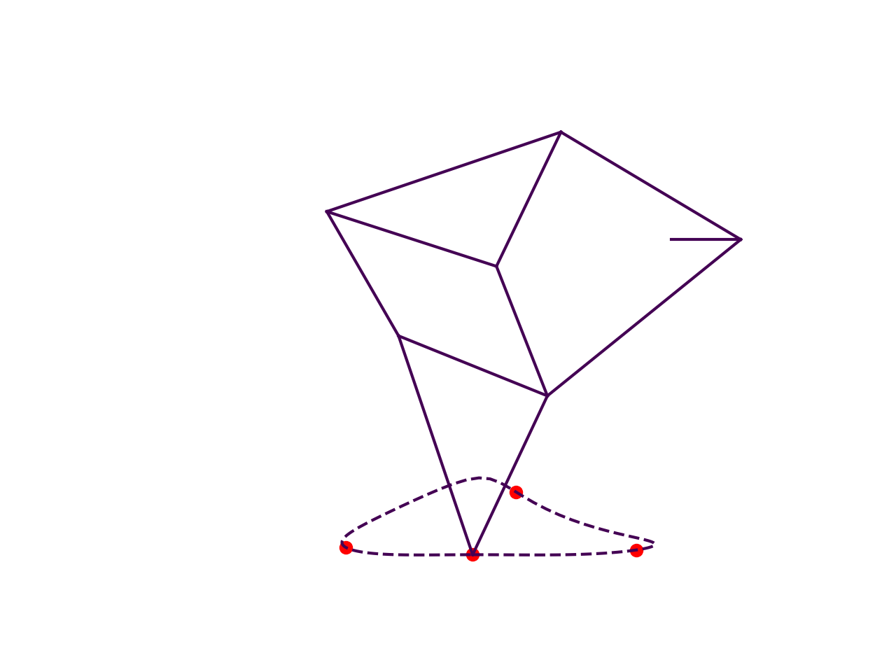

# Strandbeest Evolution Simulator

This is an implementation of a genetic algorithm for optimizing the leg mechanism of a Strandbeest, similar to the one written by Theo Jansen a few decades ago.

The fitness of a linkage is computed based on how precisely the foot path follows a predetermined trajectory, which can be configured with a bunch of waypoints. If the linkage breaks during a cycle of the crank or is otherwise invalid, it receives a fitness of -infinity.

## Running

```bash
make
./bin/strandbeest
```

This will display a help message containing instructions regarding command-line arguments.

## Visualizing

You can visualize your linkages in action using `plot.py`. See line 210.

